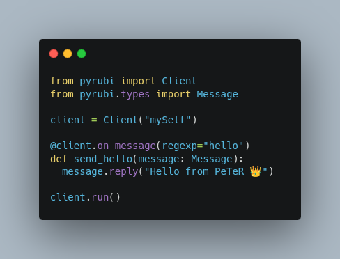

# Rubika Bot Arsenal by PeTeR 🛡️



A modular collection of Rubika bots built for Persian-speaking admins who demand full control, high precision, and viral impact across groups and channels.

All projects are powered by robust libraries like `pyrubi` or `rubpy`, enabling direct communication with Rubika’s API—no middle layers, fast, and reliable.

## 🔧 Included Projects
- [`group-manager`](./rubika-group-manager) — Full group management with ban, mute, welcome, content filtering, and user stats  
- [`Custom`](./info) - Custom account and edit all sections
- [`Report`](./Report-rubika) -  script; Account, channel, group violations report
- [`auth`](./Auth) - Session creation and other related tasks
- [`Time name`](./Time-name) - Clock next to the name(group, channel, account)


## 🚀 Highlights
- Built with modular and scalable architecture  
- Direct API integration via pyrubi or rubpy  
- JSON-based data storage for easy processing  
- Ready to connect with dashboards or external tools  
- MIT licensed and open for public use  
- Designed for Persian communities and global deployment

## 📦 Installation
Each tool lives in its own folder with a README and clear structure.  
Just enter the folder and run `main.py` :
```bash
pip install -r requirements.txt  
python main.py
```

## 🧪 Usage Examples

Simple bot examples using Rubika libraries, with messages sent by PeTeR:

### pyrubi
- install 
```bash
pip install pyrubi
```
- Usage Example
```python
from pyrubi import Client  
from pyrubi.types import Message  

client = Client("FythonDev")  

@client.on_message(regexp="hello")  
def send_hello(message: Message):  
  message.reply("Hello from Fython")  

client.run()
```
### rubpy
- install 
```bash
pip install rubpy
```
- Usage Example
```python
from rubpy import Client, filters  
from rubpy.types import Update  

bot = Client(name='FythonDev')  

@bot.on_message_updates(filters.text)  
async def updates(update: Update):  
  await update.reply("Test message from Fython")  

bot.run()
```
## rubika
```bash
pip install rubika
```
```python
from rubika import Bot, Socket
from rubika.filters import filters

bot = Bot("FythonDev")
app = Socket(bot.auth)

@app.handler(filters.PV)
def hello(message):
    message.reply("Hello from Fython")
```
## 🧠 Author
**PeTeR** — Reverse engineer, bot architect, and viral toolmaker  
Building tools that redefine control, security, and interaction in Rubika.

## 📄 License
This repository is licensed under the MIT License. See [`LICENSE`](./LICENSE) for details.
